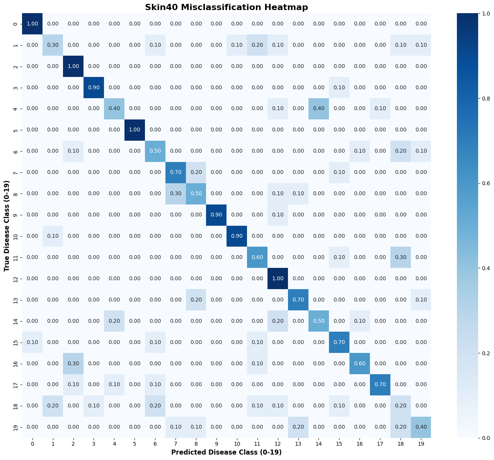

# Attempt to replicate the paper Global and Local Vision-Language Alignment for Few-Shot Learning and Few-Shot OOD Detection
The paper Authors:
```bibtex
@InProceedings{YanJie_Global_MICCAI2025,
        author = { Yan, Jie AND Guan, Xiaoyuan AND Zheng, Wei-Shi AND Chen, Hao AND Wang, Ruixuan},
        title = { { Global and Local Vision-Language Alignment for Few-Shot Learning and Few-Shot OOD Detection } },
        booktitle = {proceedings of Medical Image Computing and Computer Assisted Intervention -- MICCAI 2025},
        year = {2025},
        publisher = {Springer Nature Switzerland},
        volume = {LNCS 15964},
        month = {September},
        page = {208 -- 218}
}
```
## Acknowledgement
The author adopt these codes to create this repository.
* [Conditional Prompt Learning for Vision-Language Models](https://arxiv.org/abs/2203.05557), in CVPR, 2022.
* [Learning to Prompt for Vision-Language Models](https://arxiv.org/abs/2109.01134), IJCV, 2022.
* [Delving into Out-of-Distribution Detection with Vision-Language Representations](https://proceedings.neurips.cc/paper_files/paper/2022/hash/e43a33994a28f746dcfd53eb51ed3c2d-Abstract-Conference.html), in NeurIPS, 2022
* [Zero-Shot In-Distribution Detection in Multi-Object Settings Using Vision-Language Foundation Models](https://arxiv.org/abs/2304.04521), arXiv, 2023
* [LoCoOp: Few-Shot Out-of-Distribution Detection via Prompt Learning](https://proceedings.neurips.cc/paper_files/paper/2023/file/f0606b882692637835e8ac981089eccd-Paper-Conference.pdf), in NeurIPS, 2023

## About this fork repo:
It seem the method is replicable for accuracy test after a few change to the codes and adding dataset.

here is how to set it up in kaggle:
```
# 1. Enter working directory and clone fixed repo
%cd /kaggle/working/
!git clone https://github.com/HTuanPhong/GLAli.git
%cd GLAli
!git pull

# 2. cd Dassl toolbox
!cd Dassl.pytorch && pip install -r requirements.txt && python setup.py develop

# 3. Install GLAli's updated requirements
!pip install -r requirements.txt

# 4. Create the empty data folder needed for the pkl files
!mkdir -p ./data/Skin40/split_fewshot
```
Training:
```
# 5. Run the training!
!CUDA_VISIBLE_DEVICES=0 bash scripts/GLAli/train.sh
```

addons:
```
# to print out misclassification heatmap
import torch
import seaborn as sns
import matplotlib.pyplot as plt

cmat_path = "/kaggle/working/GLAli/output/skin40/LocProto/vit_b16_ep25_16shots/nctx16_cscFalse_ctpend/seed1_aaaaaa/cmat.pt"

# Add weights_only=False to bypass the PyTorch 2.6 security block
cmat = torch.load(cmat_path, weights_only=False)

# Plot it professionally
plt.figure(figsize=(14, 12)) # Made slightly larger for better visibility
sns.heatmap(cmat, annot=True, fmt=".2f", cmap="Blues", 
            xticklabels=True, yticklabels=True) # Ensure ticks show up

plt.ylabel('True Disease Class (0-19)', fontsize=12, fontweight='bold')
plt.xlabel('Predicted Disease Class (0-19)', fontsize=12, fontweight='bold')
plt.title('Skin40 Misclassification Heatmap', fontsize=16, fontweight='bold')

plt.tight_layout()
plt.show()
```




_______

# Thực nghiệm tái hiện bài báo: Global and Local Vision-Language Alignment for Few-Shot Learning and Few-Shot OOD Detection

Trích dẫn bài báo gốc:
```bibtex
@InProceedings{YanJie_Global_MICCAI2025,
        author = { Yan, Jie AND Guan, Xiaoyuan AND Zheng, Wei-Shi AND Chen, Hao AND Wang, Ruixuan},
        title = { { Global and Local Vision-Language Alignment for Few-Shot Learning and Few-Shot OOD Detection } },
        booktitle = {proceedings of Medical Image Computing and Computer Assisted Intervention -- MICCAI 2025},
        year = {2025},
        publisher = {Springer Nature Switzerland},
        volume = {LNCS 15964},
        month = {September},
        page = {208 -- 218}
}
```

## Lời cảm ơn (Acknowledgement)
Tác giả đã kế thừa và sử dụng mã nguồn từ các kho lưu trữ sau để xây dựng dự án này:
* [Conditional Prompt Learning for Vision-Language Models](https://arxiv.org/abs/2203.05557), CVPR, 2022.
* [Learning to Prompt for Vision-Language Models](https://arxiv.org/abs/2109.01134), IJCV, 2022.
* [Delving into Out-of-Distribution Detection with Vision-Language Representations](https://proceedings.neurips.cc/paper_files/paper/2022/hash/e43a33994a28f746dcfd53eb51ed3c2d-Abstract-Conference.html), NeurIPS, 2022
* [Zero-Shot In-Distribution Detection in Multi-Object Settings Using Vision-Language Foundation Models](https://arxiv.org/abs/2304.04521), arXiv, 2023
* [LoCoOp: Few-Shot Out-of-Distribution Detection via Prompt Learning](https://proceedings.neurips.cc/paper_files/paper/2023/file/f0606b882692637835e8ac981089eccd-Paper-Conference.pdf), NeurIPS, 2023

## Về phiên bản (fork) này:
Phương pháp này có khả năng tái hiện được kết quả kiểm thử độ chính xác (Accuracy) sau một vài chỉnh sửa nhỏ trong mã nguồn và bổ sung bộ dữ liệu.

**Tuy nhiên, có một vấn đề kỹ thuật quan trọng:** Các tác giả đã không cung cấp mã nguồn để tải (load) 158 phân lớp của tập dữ liệu SD-198 phục vụ cho việc kiểm thử OOD trong kho lưu trữ này. Có vẻ như tác giả đã sao chép nhầm logic đánh giá được sử dụng cho tập dữ liệu ISIC (vốn sử dụng DermNet làm OOD theo bài báo) và áp dụng một cách chưa chính xác vào tập Skin40 trong phiên bản phát hành trên GitHub.

## Hướng dẫn thiết lập trên Kaggle:

```bash
# 1. Truy cập thư mục làm việc và clone repo đã được chỉnh sửa
%cd /kaggle/working/
!git clone https://github.com/HTuanPhong/GLAli.git
%cd GLAli
!git pull

# 2. Cài đặt bộ công cụ Dassl
!cd Dassl.pytorch && pip install -r requirements.txt && python setup.py develop

# 3. Cài đặt các thư viện bổ sung của GLAli
!pip install -r requirements.txt

# 4. Tạo thư mục dữ liệu trống để chứa các file .pkl
!mkdir -p ./data/Skin40/split_fewshot
```

## Huấn luyện (Training):
```bash
# 5. Bắt đầu quá trình huấn luyện!
!CUDA_VISIBLE_DEVICES=0 bash scripts/GLAli/train.sh
```
