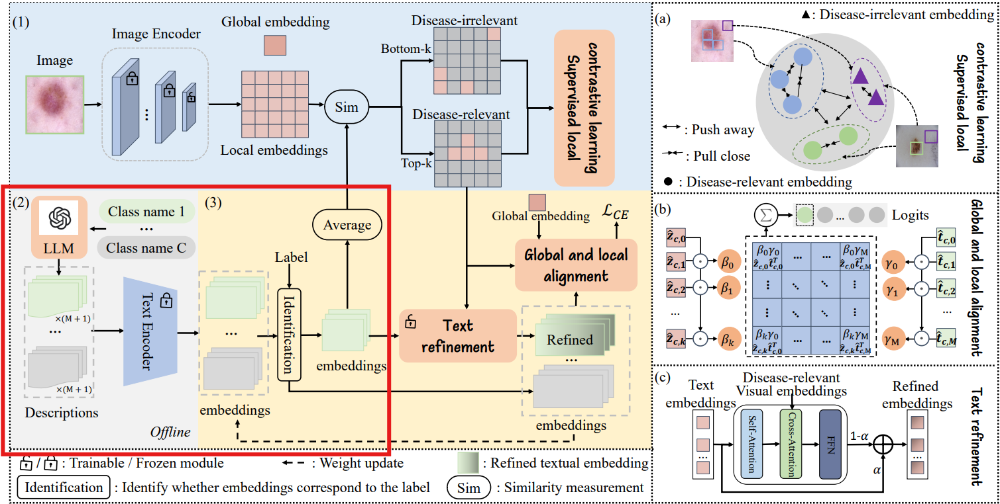
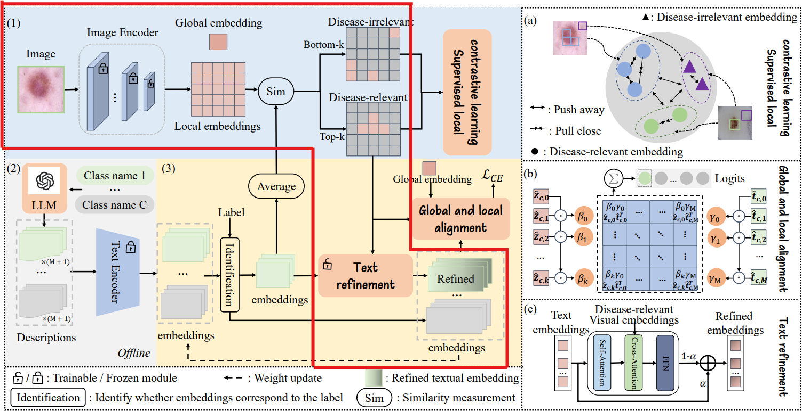
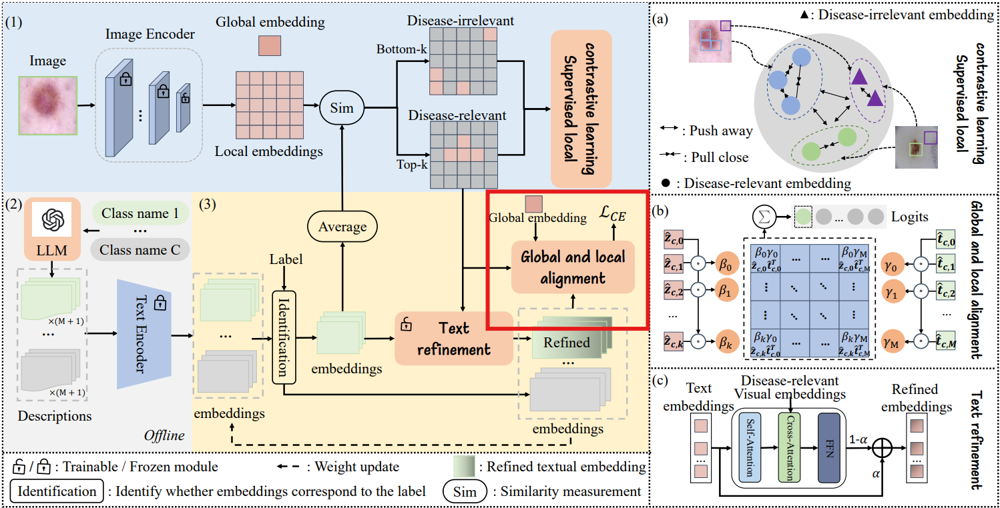
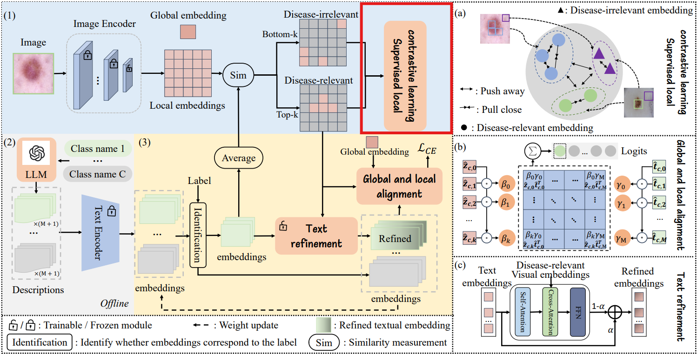

Fewshot learning cho bài toán phân lớp. Đưa vào 1 ảnh và nhận về 1 nhãn

Dữ liệu là:
- Ảnh 
- Nhãn

Vì bài toán fewshot learning là bài toán ill posed:
$$P(\theta \mid \mathcal{D}) \propto \underbrace{P(\mathcal{D} \mid \theta)}_{\text{yếu}} \cdot \underbrace{P(\theta)}_{\text{mình kiểm soát}}$$
Do đó phải tăng $P(\theta)$ bằng cách thêm prior knowledge thông qua các foundation model.

Foundation model là: 
- CLIP dựa trên ViT

Tận dụng prior knowledge là: 
- Text prompt mô tả hình dạng từng loại bệnh.

Khoảng trống nghiên cứu mà tác giả muốn cải thiện:
- **Các Prompt văn bản Yếu và Mơ hồ:** CLIP tiêu chuẩn dựa vào các mẫu cơ bản như "một bức ảnh của [TÊN LỚP]". Đối với một căn bệnh như Actinic Keratosis, chỉ riêng cái tên không cho mô hình biết cần tìm kiếm những đặc điểm hình ảnh nào.
- **Khoảng cách phương thức:** CLIP có kiến trúc nghiêm ngặt. Bộ mã hóa hình ảnh và bộ mã hóa văn bản không bao giờ "trò chuyện" với nhau cho đến tận bước cuối cùng, nơi các vector của chúng đơn giản là được nhân với nhau (tích vô hướng). Chúng không chia sẻ ngữ cảnh.
- **Không tập trung vào các vùng cục bộ:** CLIP tiêu chuẩn mã hóa toàn bộ hình ảnh thành một vector toàn cục duy nhất. Điều này ổn khi nhận diện một con mèo, nhưng lại rất tệ đối với hình ảnh y tế, nơi mà bệnh lý (tổn thương) có thể chỉ chiếm 5% bức ảnh, trong khi 95% còn lại là da khỏe mạnh hoặc vùng nền. 
- **Nhiễu từ vùng nền làm hỏng khả năng phát hiện OOD:** CLIP tiêu chuẩn dễ bị nhầm lẫn bởi vùng nền. Nếu một bệnh ngoài da mới, chưa từng biết đến xuất hiện trên một cánh tay người bình thường, CLIP tiêu chuẩn có thể sẽ nói "Tôi nhận ra cánh tay này!" và phân loại sai nó thành một căn bệnh đã biết

### 🛠️ Giai đoạn 1: Huấn luyện Từng bước (Training)

**Bước 1: Khởi tạo Nguyên mẫu Văn bản bằng LLM**

*   **Những gì tác giả thực hiện:** Trước khi quá trình huấn luyện bắt đầu. Với mỗi lớp bệnh $c$, họ lấy prompt tiêu chuẩn ("một bức ảnh của [Lớp]") (gọi là $t_{c,0}$) và nối thêm $M$ câu văn do LLM tạo ra (từ $t_{c,1}$ đến $t_{c,M}$) mô tả chi tiết kết cấu, màu sắc và hình dạng của bệnh. Họ đưa toàn bộ tập hợp này qua Bộ mã hóa Văn bản CLIP bị đóng băng để tạo ra một tập hợp các vector (embeddings) $T_c$. Sau đó, họ tính trung bình cộng để tạo ra một vector chủ đạo $\bar{t}_c$:
  $$\bar{t}_c = \frac{1}{M+1}\sum_{j=0}^M t_{c,j}$$
  * **Giải thích toán học:** Phép tổng $\sum$ và chia trung bình này nhằm tạo ra một "trọng tâm" (center of gravity) trong không gian vector. Thay vì chỉ có 1 điểm duy nhất (tên bệnh), giờ đây ta có một cụm điểm bao gồm hàng tá đặc điểm hình ảnh. $\bar{t}_c$ chính là điểm nằm ở giữa cụm đó.
*   **✅ Giải quyết Vấn đề 1 (Prompt văn bản yếu và mơ hồ):** CLIP tiêu chuẩn chỉ biết tên bệnh. Bằng cách tiêm trực tiếp $M$ mô tả LLM vào các embedding văn bản ngay trước khi huấn luyện, mô hình bị bắt buộc về mặt toán học phải tìm kiếm các kết cấu hình ảnh cụ thể (như "có vảy" hoặc "nâu đỏ") thay vì phải tự đoán xem cái tên đó có ý nghĩa gì.

**Bước 2: Mạng Cross-Attention (Tinh chỉnh văn bản bằng hình ảnh)**

*   **Những gì tác giả thực hiện:** Một batch hình ảnh được tải lên. Image encoder xuất ra vector toàn cục $z_0$ và các vector cục bộ (các patch ảnh) $z_i$. Mã tính toán độ tương đồng (cosine similarity) giữa các patch ảnh này và vector chủ đạo $\bar{t}_c$ ở Bước 1. Nó sử dụng thuật toán Top-K để phân loại:
    * **Top-k patch** khớp cao nhất được tách ra làm Tổn thương (ID).
    * **Bottom-k patch** khớp thấp nhất được tách ra làm Vùng nền/da khỏe mạnh (OOD).

  Mã lấy các Top-k patch tổn thương và đưa vào mạng Cross-Attention cùng với các embedding văn bản. Tại đây, hình ảnh giúp cập nhật (refine) văn bản. Kết quả đầu ra là một vector văn bản mới $t'_{c,j}$. Tác giả kết hợp vector mới này với vector gốc bằng công thức nội suy:
  $$\hat{t}_{c,j} = \alpha t_{c,j} + (1-\alpha)t'_{c,j}$$
  * **Giải thích toán học:** * $t_{c,j}$ là văn bản gốc (nguyên thủy).
    * $t'_{c,j}$ là văn bản *sau khi đã nhìn thấy* hình ảnh tổn thương.
    * $\alpha$ là hệ số cân bằng (ví dụ $\alpha = 0.99$).
  * **Ý đồ của tác giả:** Tại sao lại phải cộng hai cái này lại theo tỷ lệ $\alpha$? Đây là kỹ thuật *Residual/Momentum*. Tác giả muốn vector văn bản học hỏi thêm từ hình ảnh tổn thương thực tế (phần $t'$), nhưng **không được phép quên** đi ngữ nghĩa gốc rễ của nó (phần $t$). Nếu không có $\alpha$, mô hình sẽ bị "nhớ mới quên cũ" (catastrophic forgetting).
*   **✅ Giải quyết Vấn đề 2 (Khoảng cách Phương thức):** CLIP tiêu chuẩn giữ văn bản và hình ảnh cách ly hoàn toàn. Cross-Attention và công thức nội suy trên cho phép embedding văn bản tự nắn chỉnh tọa độ của nó trong không gian dựa trên dữ liệu hình ảnh thực tế, thu hẹp khoảng cách giữa hai phương thức.

**Bước 3: Tính toán Dense Logit (Căn chỉnh hình ảnh - văn bản Cục bộ và Toàn cục)**

*   **Những gì tác giả thực hiện:** Thay vì chỉ dùng phép nhân vô hướng đơn giản giữa toàn bộ ảnh và toàn bộ chữ, tác giả thiết kế một hệ thống "Bỏ phiếu có trọng số" để đưa ra dự đoán phân loại (Logit $u_c$).
  Đầu tiên, tính trọng số cho từng patch ảnh ($\beta_i$) và từng câu văn ($\gamma_j$):
  $$\beta_i = \frac{\exp(h(\hat{z}_{c,i}, z_0))}{\sum_{a=0}^k \exp(h(\hat{z}_{c,a}, z_0))}, \quad \gamma_j = \frac{\exp(h(\hat{t}_{c,j}, \hat{t}_{c,0}))}{\sum_{a=0}^M \exp(h(\hat{t}_{c,a}, \hat{t}_{c,0}))}$$
  * **Giải thích toán học:** Hàm $h()$ là hàm tính khoảng cách (cosine similarity). Hàm $\exp()$ và $\sum$ tạo thành hàm Softmax kinh điển. 
  * **Ý đồ tác giả:** Ký hiệu $\beta_i$ (Trọng số ảnh) đo lường xem một patch ảnh nhỏ ($z_{c,i}$) có đại diện tốt cho toàn bộ bức ảnh ($z_0$) hay không. Nếu có, nó được cấp quyền "bỏ phiếu" cao hơn. Tương tự, $\gamma_j$ (Trọng số văn bản) cấp quyền bỏ phiếu cao hơn cho những câu mô tả mang tính cốt lõi của căn bệnh đó.
  
 Tiếp theo, dự đoán của mô hình ($u_c$) được tính bằng:
  $$u_c = \sum_{i=0}^k \sum_{j=0}^M \beta_i \gamma_j h(\hat{z}_{c,i}, \hat{t}_{c,j})$$
  * **Ý đồ tác giả:** Dấu tổng kép $\sum \sum$ là phần cốt lõi. Nó tính điểm số tương đồng ($h$) giữa từng phần của bức ảnh với từng phần của văn bản, nhưng điểm số này được nhân với hệ số tin cậy ($\beta_i \gamma_j$). Những patch nhiễu sẽ có $\beta_i$ cực thấp và gần như biến mất khỏi phép cộng này.

  Cuối cùng, Logit $u_c$ được đưa vào hàm mất mát Cross-Entropy ($\mathcal{L}_{CE}$) để huấn luyện:
  $$\mathcal{L}_{CE} = -\log \frac{\exp(u_y / \tau)}{\sum_{c=1}^C \exp(u_c / \tau)}$$
  *(Với $y$ là nhãn thực của ảnh và $\tau$ là nhiệt độ).*
  * **Ý đồ Tối ưu hóa:** Hàm Loss đóng vai trò là "áp lực tiến hóa". Để hàm Loss giảm, $u_y$ (điểm của lớp đúng) bắt buộc phải vượt trội. Điều này ép toàn bộ mạng lưới (từ mạng Cross-Attention đến các trọng số $\beta, \gamma$) phải tự nắn chỉnh để nhận diện chính xác các đặc trưng nhỏ nhất.

*   **✅ Giải quyết Vấn đề 3 (Mù quáng cục bộ):** Dự đoán cuối cùng không chỉ dựa trên toàn bộ hình ảnh; nó được đánh trọng số về mặt toán học bởi mức độ khớp của các patch cục bộ (tổn thương) so với các mô tả văn bản chi tiết.

**Bước 4: Học Tương phản có Giám sát (Supervised Local Contrastive Learning)**

*   **Những gì tác giả thực hiện:**  Cụ thể, hàm loss này sẽ làm các việc sau:
  1. Lấy Top-K patch (tổn thương) và gán cho chúng **nhãn thực sự** của hình ảnh (ví dụ: bệnh Eczema).
  2. Lấy Bottom-K patch (da khỏe/vùng nền - lấy từ Bước 2) và ép gán cho chúng một **nhãn giả là OOD** (một lớp không tồn tại).
  3. Tính toán hàm Loss tương phản (SupCon Loss):
  $$\mathcal{L}_{SC} = -\frac{1}{S} \sum_{s=1}^S \frac{1}{|P(s)|} \sum_{p \in P(s)} \log \frac{\exp(g(z_s, z_p)/\tau)}{\sum_{a=1}^S \exp(g(z_s, z_a)/\tau)}$$
  * **Giải thích toán học & Ý đồ tác giả:** Nhìn vào phân số bên trong dấu Log.
    * **Tử số:** $\exp(g(z_s, z_p))$. Đây là khoảng cách giữa 2 patch có **CÙNG** nhãn (ví dụ: patch tổn thương A và patch tổn thương B). Để hàm Loss giảm, thuật toán bắt buộc phải làm tử số này to lên $\rightarrow$ **Kéo các patch bệnh lý lại gần nhau.**
    * **Mẫu số:** $\sum \exp(g(z_s, z_a))$. Đây là khoảng cách giữa patch hiện tại với **TẤT CẢ** các patch khác, bao gồm cả các patch "Vùng nền nhãn giả". Để hàm Loss giảm, thuật toán phải làm mẫu số nhỏ đi $\rightarrow$ **Đẩy các patch vùng nền văng ra thật xa khỏi các patch bệnh lý.**
*   **✅ Giải quyết Vấn đề 4 (Can nhiễu vùng nền):**  Buộc mô hình đẩy các các patch nền ra thật xa khỏi các embedding văn bản của bệnh trong không gian tiềm ẩn, dạy cho mô hình cách chủ động phớt lờ vùng nền.

---

### 🔍 Giai đoạn 2: Suy luận & Phát hiện OOD Từng bước (Inference)

Trong quá trình suy luận, mô hình bị đóng băng hoàn toàn. Nó phải nhìn vào một hình ảnh mới và tính toán một "Điểm số OOD" để xác định xem hình ảnh đó là một căn bệnh đã biết hay là một điểm dị thường.

**Bước 0: Tiền xử lý (Image Preprocessing):**
* **Thao tác:** Ảnh y tế đầu vào được resize về kích thước chuẩn của CLIP (thường là $224 \times 224$ pixels).
* **Chia Patch:** Ảnh được cắt thành các mảnh nhỏ (patches). Với ViT-B/16, ảnh $224 \times 224$ sẽ được chia thành $14 \times 14 = 196$ patches. Mỗi patch này đại diện cho một vùng không gian cục bộ trên da.

**Bước 1: Trích xuất Đặc trưng & Tính toán Logits**
*   **Những gì tác giả thực hiện:** Một hình ảnh mới được đưa qua Vision Transformer Encoder để trích xuất đặc trưng toàn cục và các patch cục bộ. Mô hình thực hiện tính toán Logit $u_c$ theo đúng công thức ở Giai đoạn 1 cho từng class đã học. Thì bước này họ dùng lại những refined text embedding đã học.
*   **✅ Giải quyết Vấn đề 3 (Mù quáng cục bộ):** Bằng cách gần như hoàn toàn dựa vào đặc trưng patch cục bộ trong quá trình suy luận, mô hình bỏ qua ngữ cảnh toàn cục (có thể là một vùng nền gây bối rối) và đưa ra quyết định chỉ dựa trên các patch bệnh lý đã được khoanh vùng.

**Bước 2: Softmax & Khớp Khái niệm Tối đa (MCM)**
*   **Những gì tác giả thực hiện:** Các logit $u_c$ sinh ra từ Bước 1 sẽ được đưa qua hàm tính điểm OOD gọi là MCM score ($Q$):
  $$Q = \max_c \frac{\exp(u_c/\tau')}{\sum_{a=1}^C \exp(u_a/\tau')}$$
  * **Giải thích toán học & Ý đồ:** Đây thực chất là hàm Softmax với một "nhiệt độ" $\tau'$ để làm mịn phân phối, sau đó dùng toán tử $\max$ để lấy ra xác suất của lớp mà mô hình tự tin nhất. 

*   **✅ Giải quyết Vấn đề 1 & 4:** Đây là đòn quyết định loại bỏ sự can nhiễu từ vùng nền. 
  * Nếu ảnh chứa một căn bệnh đã biết (ID), các patch tổn thương sẽ khớp hoàn hảo với nguyên mẫu văn bản (vốn đã được LLM làm cho rất chi tiết), tạo ra một logit $u_c$ cực kỳ lớn, dẫn đến điểm $Q$ tiến sát về 1.
  * Nếu hình ảnh thực sự là OOD (ví dụ: một chiếc ô tô, hoặc một bệnh ngoài da chưa từng biết), các patch cục bộ sẽ không thể khớp với *bất kỳ* cụm từ chi tiết nào như "có vảy, viền đỏ...". Tất cả các logit $u_1, u_2... u_C$ đều sàn sàn như nhau ở mức rất thấp. Khi đi qua hàm Softmax, nó tạo ra một phân phối phẳng, làm cho giá trị lớn nhất ($Q$) tụt thê thảm. Hệ thống chỉ cần đặt một ngưỡng (threshold) để tóm gọn những ảnh có $Q$ thấp này và gán mác OOD.

### Tóm tắt

Chúng ta có thể thấy rằng **GLAli** về cơ bản là một công cụ phẫu thuật sắc bén. Nó sử dụng LLM để biết cần phải tìm kiếm điều gì, sử dụng các local patch từ ViT và Top-K để cắt tách các vùng bệnh ra khỏi vùng nền, sử dụng Cross-Attention để dạy cho văn bản biết hình dáng thực tế của căn bệnh là gì. Sử dụng học tương phản để đẩy các vùng ảnh từng class ra xa nhau làm điểm số OOD trở nên rất lớn nhằm phát hiện OOD tốt hơn.